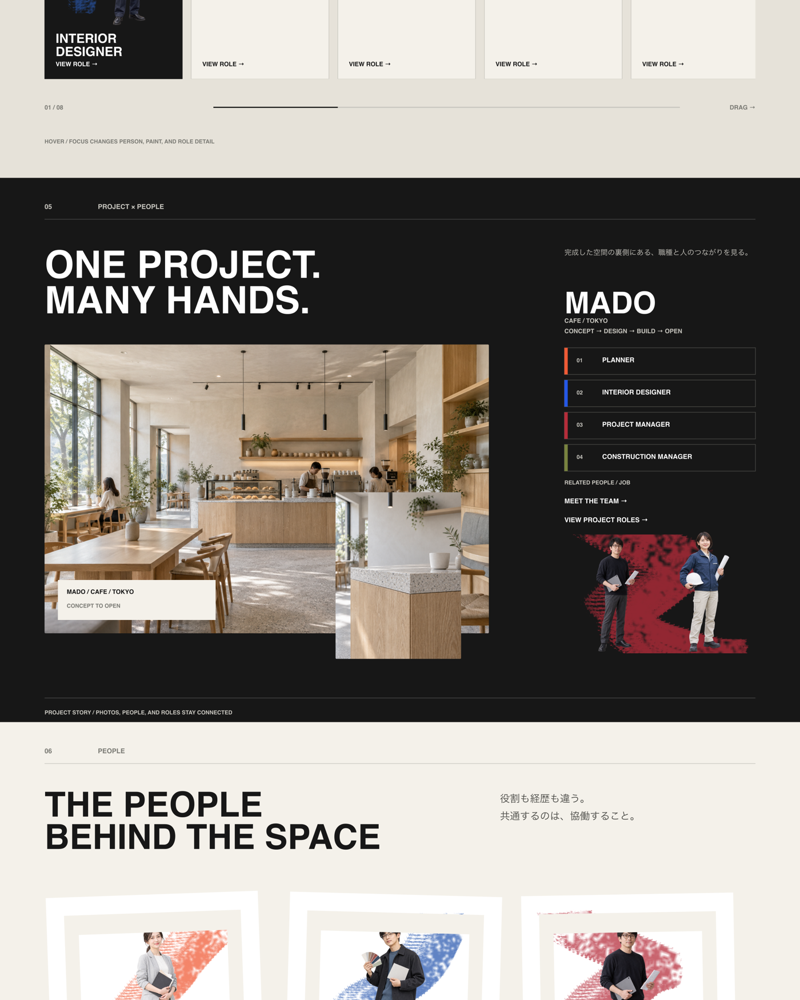
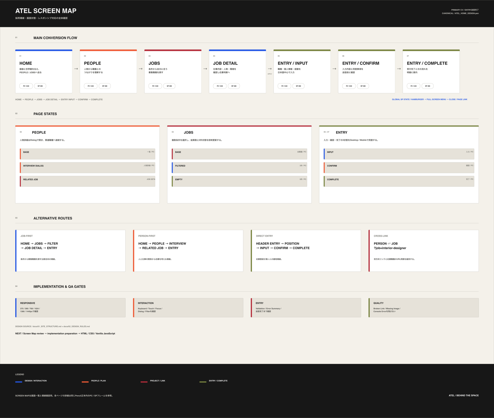
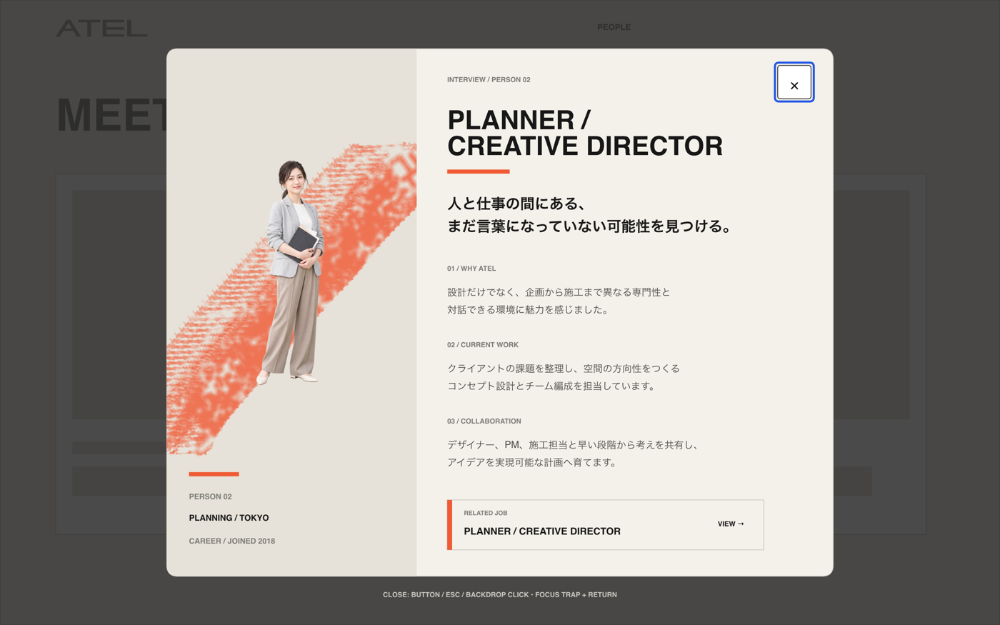
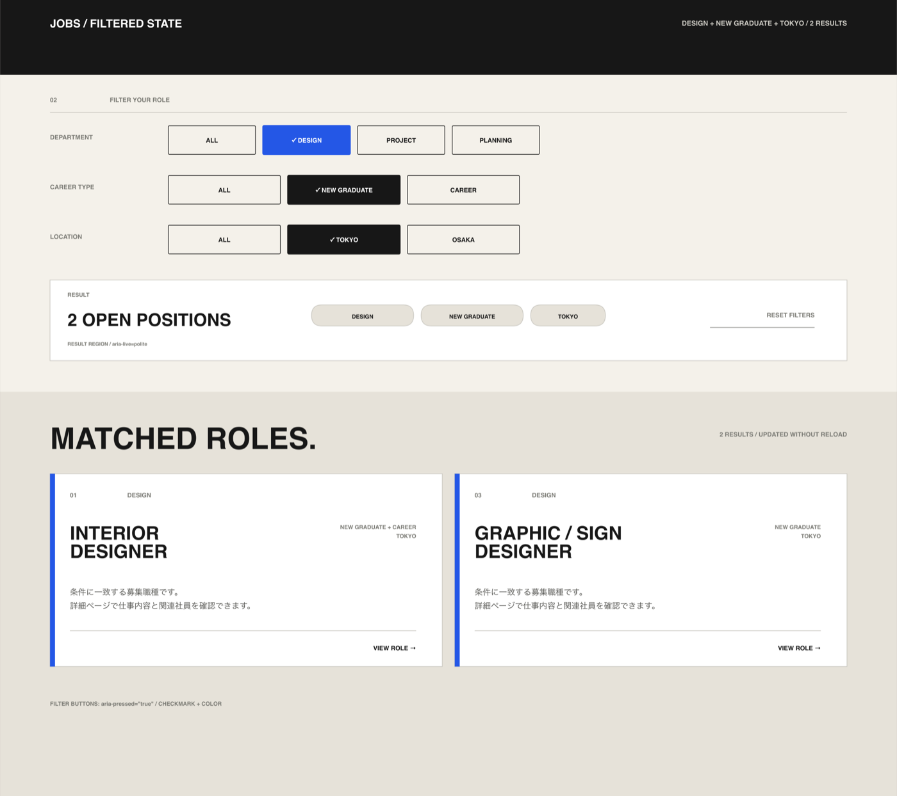
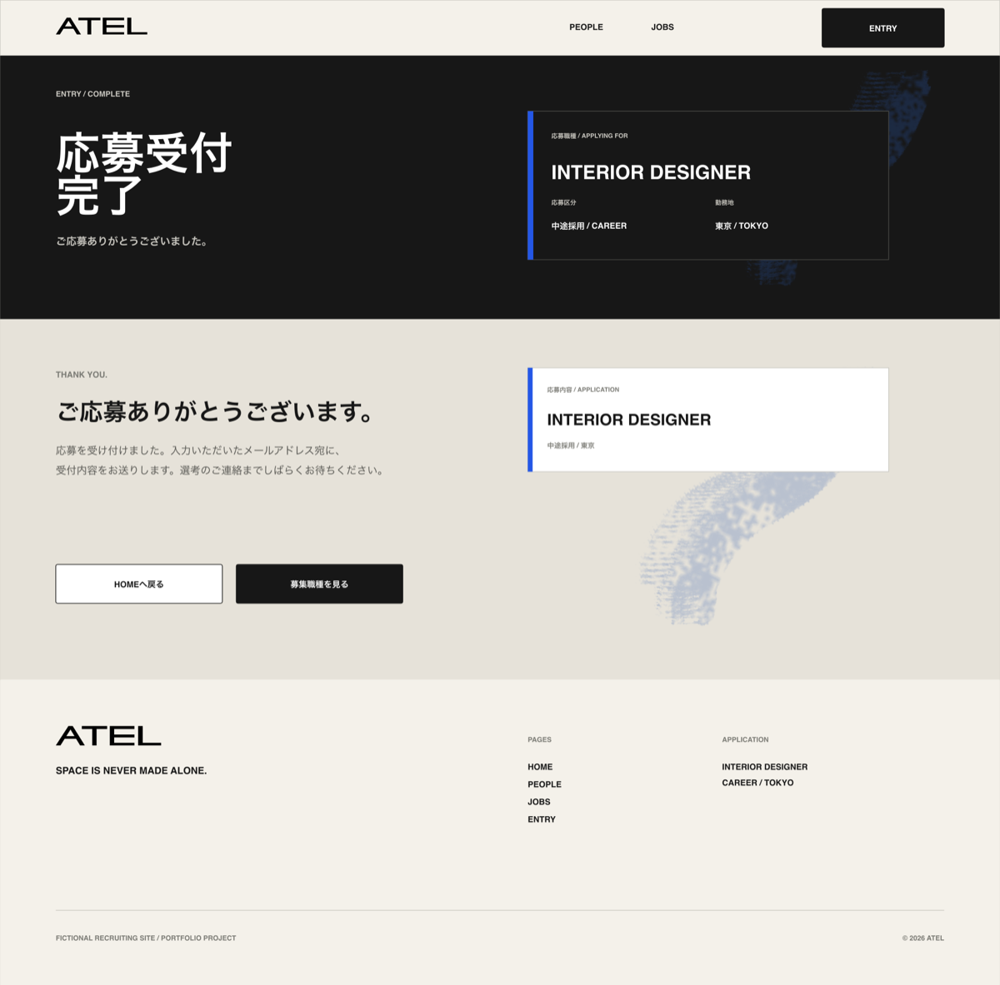

# ATEL Recruiting Site

> SPACE IS NEVER MADE ALONE.
>
> ひとりでは、空間はつくれない。

店舗・商業空間の設計、デザイン、施工を手がける架空企業「ATEL」を想定した、複数ページ構成の採用・キャリアサイトです。

**Live Demo:** [https://coconattsu0723.github.io/atel-recruiting-site/](https://coconattsu0723.github.io/atel-recruiting-site/)



## Overview

完成した空間の実績だけでは伝わりにくい「どんな人が、どのように空間をつくっているのか」を可視化し、求職者が自分に合う職種を見つけて応募まで進める体験を設計しました。

| 項目 | 内容 |
| --- | --- |
| Site Type | Multi-page Recruiting Site |
| Target | 建築・インテリア・空間デザイン領域の新卒、第二新卒、中途人材 |
| Primary CV | ENTRYフォームの完了 |
| Pages | HOME / PEOPLE / JOBS / JOB DETAIL / ENTRY |
| Concept | `BEHIND THE SPACE` |
| Status | GitHub Pagesで公開・Production QA完了 |

## Problem

空間デザイン会社の採用情報では、完成事例の魅力に比べて、職種の違い、仕事のつながり、働く人、応募条件が分散しやすいという課題があります。

ATELでは、次の疑問を順番に解消できる情報設計を目指しました。

- どのような職種があるのか
- 職種同士がどう連携するのか
- どのような人が働いているのか
- 自分に合う募集条件があるのか
- 応募前に何を確認すればよいのか

## Solution

- HOMEで、空間づくりの工程・職種・人物・募集を一つのストーリーとして紹介
- PEOPLEのInterview Dialogから関連職種へ移動できる双方向導線
- JOBSでDepartment / Career Type / Locationを組み合わせるAND検索
- JOB DETAILを8職種共通のテンプレートとデータで切り替える構成
- JOB DETAILからENTRYへ職種情報を引き継ぐ応募フロー
- ENTRYにError / Confirm / Completeの状態を用意し、送信前後の理解を支援



## Key Screens and States

### PEOPLE — Interview Dialog

人物の仕事観を読み物として見せながら、関連する募集職種へ接続します。Dialogの開閉、URL、Focus Returnを同期しています。



### JOBS — Filtered / Empty State

複数条件による絞り込み、該当件数、選択中条件、URL状態、0件時の案内をページ再読み込みなしで更新します。



### ENTRY — Input / Confirm / Complete

職種を引き継いだ入力、エラー表示、内容確認、完了までを一続きの体験として設計しました。



## Design Direction

`Architectural × Editorial × Human`を軸に、建築的な情報整理と、人・写真・Paint Graphicの偶発性を組み合わせています。

- Base：Off White `#F4F1EA` / Ink `#171717`
- Department Accent：Blue / Orange / Red / Green
- English Display：Space Grotesk
- Japanese / Body：Noto Sans JP
- Image Frame：Rectangle / Circle / Polaroid / Organic Mask
- Responsive：Mobile First、4 / 8 / 12 Column Grid

## Implementation Highlights

- HTML5 / CSS3 / Vanilla JavaScriptのみで実装
- Job / Person情報を共通データとして管理
- Query ParameterでFilter、Interview、職種、応募職種を同期
- `dialog`、`aria-expanded`、`aria-pressed`、`aria-live`を用いた状態通知
- Mobile MenuとInterview DialogのFocus管理・背景Scroll停止
- FormのError Summary、Field Error、Confirm、Completeを実装
- `prefers-reduced-motion`へ対応
- 公開用Buildで参照されるファイルだけを`dist/`へ出力

## QA

- 375 / 390 / 768 / 1024 / 1366 / 1440pxを確認
- Horizontal Scroll、Text Wrap、画像Crop、Focus、Keyboard操作を確認
- Broken Link、Missing Image、Console Errorなし
- 全5ページのStatic Site Audit：0 Error / 0 Warning
- Production上でDialog、Filter、無効Query、Form Demo、404を確認

## Tech Stack

- Pencil
- Photoshop（Paint Graphic・画像加工）
- HTML5
- CSS3
- Vanilla JavaScript
- Git / GitHub
- GitHub Pages

## Project Structure

```text
.
├── index.html
├── pages/
├── assets/
│   ├── css/
│   ├── js/
│   ├── images/
│   └── brand/
├── docs/
├── scripts/
└── package.json
```

## Build

```sh
npm run build
```

公開対象は`dist/`へ出力されます。`dist/`は直接編集せず、元ファイルを修正して再生成します。

## Notes

- ATELはポートフォリオ用に設定した架空企業です。
- 掲載する人物、募集情報、企業情報はフィクションです。
- ENTRYは操作確認用のDemoであり、入力内容の外部送信は行いません。

ポートフォリオ掲載用の文章と画像選定は[Portfolio Case Study](docs/06_PORTFOLIO_CASE_STUDY.md)にまとめています。
